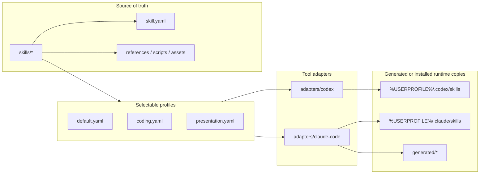

# Li's AI Skills

Portable source-of-truth repo for reusable AI-agent skills.

This repo is intentionally separate from vendor or system-managed skill sets:

- Do not copy Codex system skills from `%USERPROFILE%\.codex\skills\.system`.
- Do not copy vendor-managed MATLAB Agentic Toolkit skills from `%USERPROFILE%\.matlab\agentic-toolkits`.
- Keep only user-authored reusable skills under `skills/`.

## Skill System Map



The important rule is that `skills/` is edited by humans; adapters create tool-specific runtime copies.

## Layout

```text
Li-AI-Skills/
  skills/                 # Source of truth, hand-edited
  adapters/               # Tool-specific install/sync logic
  profiles/               # Which skills are enabled for each workflow
  generated/              # Disposable generated bundles
  tools/                  # Repo-level helper scripts
  docs/                   # Maintenance notes
  tests/                  # Validation and sample prompts
```

## Current Runtime Support

- Codex CLI via `adapters/codex`.
- Claude Code via `adapters/claude-code`.

The repo is adapter-based so more agents can be added later without changing the source skills.

## Common Commands

Validate the repo:

```powershell
.\tools\validate-repo.ps1
```

List skills:

```powershell
.\tools\list-skills.ps1
```

Install enabled skills into Codex:

```powershell
.\adapters\codex\install.ps1
```

Export/install enabled skills for Claude Code:

```powershell
.\adapters\claude-code\install.ps1
```

## Source-of-Truth Rule

Edit skills in this repo first. Then run the adapter install script for the target agent.

If a skill was edited directly in a runtime folder, run that adapter's `sync-from-runtime.ps1` to bring the change back into this repo before continuing.
